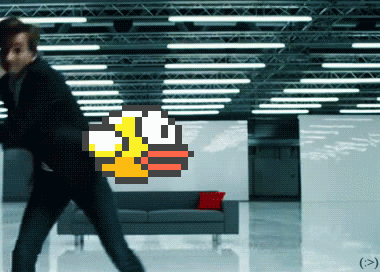

# **`Flappy Bird xD`** a Flappy Bird clone game
### Created by [Lobinux](https://www.linkedin.com/in/lobinux/) (Matias Galarza)

##### Original game created by [Dong Nguyen](https://en.wikipedia.org/wiki/Flappy_Bird)

---
## `Introducción`
> Este solo es un clon de un juego clásico...
---
## *`Mecánicas Base`*

* >✦El character (pajaro) se muestra a la izquierda sin moverse, con la primer interaccion comienza el juego.
   * >✓ Las interacciones pueden ser click en pantalla o un boton.
   * >✓ La interraccion hace que el pajaro de pequeños saltos.
   * >✓ El pajaro solo cae por "gravedad".

* >✦Obstaculos
   * >✓ Los obstaculos aparecen del lado derecho de la pantalla.
   * >✓ La altura de estos obstaculos varian de manera randon pero siempre permitiendo un hueco por donde pasar.
   * >✓ Se mueven de derecha a izquierda a una velocidad constante.
   * >✓ Pasar por el medio otorga puntos.

* >✦Condicion de victoria.
   * >✓ En el juego original no existe la condicion de victoria.

* >✦ Condicion de derrota.
   * >✓ Si el pajaro toca uno de los obstaculos.
   * >✓ Si el pajaro toca la parte superior o inferior de la pantalla.